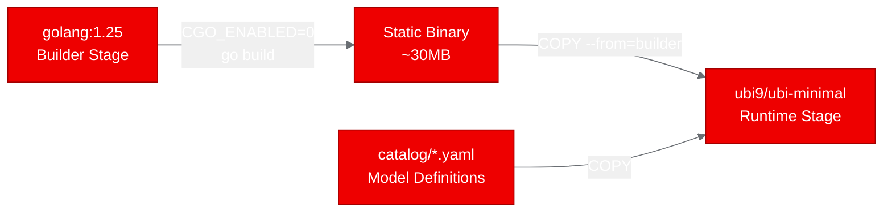
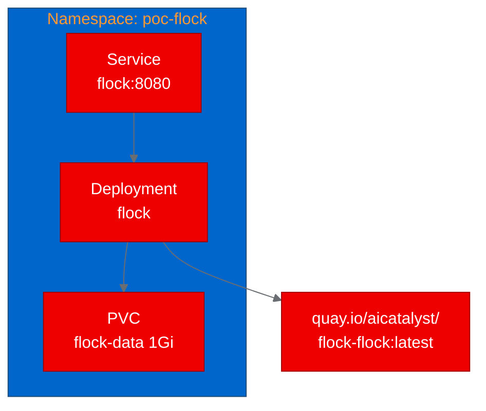

## Running a self-hosted LLM gateway on OpenShift with Flock

Teams running LLM inference on shared infrastructure quickly hit a wall: who's calling which model, how much are they using, and how do you enforce quotas without building a custom gateway from scratch? Flock is an open source Go project that solves this by turning any inference backend into a managed API with built-in authentication, usage tracking, and an admin dashboard.

We deployed Flock on OpenShift to see if it works as a containerized service alongside Red Hat OpenShift AI model serving. Here's what happened.

## What is Flock?

Flock is a single Go binary that acts as an LLM control plane. It sits between your users and your inference engines (Ollama, vLLM, llama.cpp, or cloud APIs like Anthropic and OpenAI) and provides:

- **OpenAI and Anthropic API compatibility** so existing tools work without changes
- **Per-user API keys** with daily token quotas
- **Full audit logging** of every request
- **An embedded admin dashboard** for monitoring usage and managing keys
- **Prometheus metrics** for integration with your cluster's monitoring stack
- **Multi-machine routing** to distribute load across inference backends

The entire project compiles to a single static binary with an embedded web UI. There's no database server to run: Flock uses pure-Go SQLite for state, which means no CGO and no native dependencies.

## Why a self-hosted LLM gateway matters

If you're running vLLM or Ollama on OpenShift AI, you have inference endpoints. What you don't have out of the box is a way to manage who can access them, track usage per team, and enforce spending limits. Commercial API gateways exist, but they add cost and complexity.

Flock fills that gap as a lightweight, self-hosted layer. Deploy it alongside your inference stack and point it at your model serving endpoints. Every request gets authenticated, logged, and metered without changing your client code.

## Containerizing Flock for OpenShift

Flock requires Go 1.25, which is bleeding-edge enough that it's not available in standard UBI toolset images. We solved this with a multi-stage Dockerfile: the first stage uses the official `golang:1.25` image to compile the binary, and the second stage copies it into `ubi9/ubi-minimal` for the runtime.



The key Dockerfile decisions:

- **`CGO_ENABLED=0`** produces a fully static binary. Flock uses `modernc.org/sqlite`, a pure-Go SQLite implementation, so no C libraries are needed at runtime.
- **Catalog files** (37 YAML files defining model configurations) are bundled into the image at `/opt/app-root/catalog/`.
- **Data directory** at `/opt/app-root/data` is backed by a PersistentVolumeClaim for the SQLite database and configuration state.
- **User 1001** and group 0 permissions follow OpenShift's arbitrary UID security model.

The build ran on-cluster using an OpenShift binary build, which uploaded the source, compiled the Go binary, and pushed the resulting image to Quay.io in about three minutes.

## Deploying and testing on the cluster

The deployment is minimal: one Deployment, one Service, and one PVC.



Flock started up in seconds, auto-generated an admin API key, and began serving on port 8080. We ran four test scenarios:

| Test | Endpoint | Result | Details |
|---|---|---|---|
| Health check | `/healthz` | Pass | Returns "ok" in 30ms |
| Admin dashboard | `/` | Pass | Full HTML dashboard with Tailwind CSS |
| Models API | `/v1/models` | Pass | Returns 401 without key (correct), 200 with key |
| Prometheus metrics | `/metrics` | Pass | Exposes `flock_router_*` and Go runtime metrics |

All four passed. The `/v1/models` test was particularly informative: Flock correctly enforces API key authentication on all `/v1/*` endpoints, returning 401 for unauthenticated requests. This is exactly the behavior you want from a gateway sitting in front of your inference stack.

## What we learned

**Flock is exceptionally container-friendly.** The single-binary, pure-Go architecture with embedded assets means there's almost nothing to configure. No frontend build step, no database server, no CGO headaches. The build-to-running time was under five minutes.

**The Go 1.25 requirement is the biggest friction point.** Since UBI's go-toolset image may not ship Go 1.25 yet, the multi-stage build with the upstream Go image is the practical path. This is a temporary issue that resolves as UBI images update.

**API key management works out of the box.** Flock generates an admin key on first startup and supports creating additional keys with per-user quotas. This means you get basic multi-tenant access control without any additional infrastructure.

**No inference engine required to validate.** Flock runs independently and returns empty model lists when no backend is configured. For a full production deployment, you would point it at your vLLM or Ollama instances using environment variables.

## Try it yourself

The complete deployment is available in the [aicatalyst-team/flock](https://github.com/aicatalyst-team/flock) repository on the `autopoc-artifacts` branch. You'll find:

- `Dockerfile.ubi`: Multi-stage UBI Dockerfile
- `kubernetes/`: Ready-to-apply manifests
- `poc_test.py`: Validation test script
- `poc-report.md`: Full PoC report

To deploy on your own cluster:

```bash
git clone https://github.com/aicatalyst-team/flock
kubectl apply -f kubernetes/
```

Then configure `FLOCK_OLLAMA_ENDPOINT` to point at your inference backend and start routing LLM traffic through a proper gateway.
