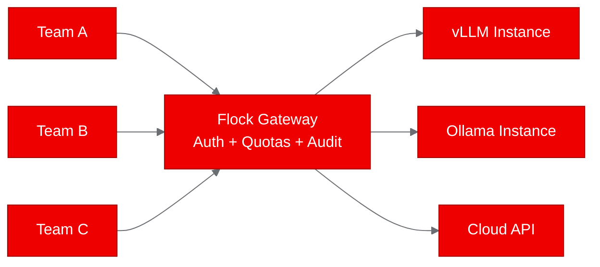
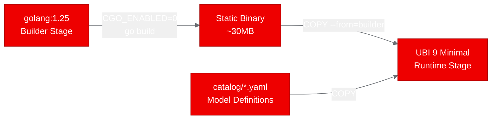
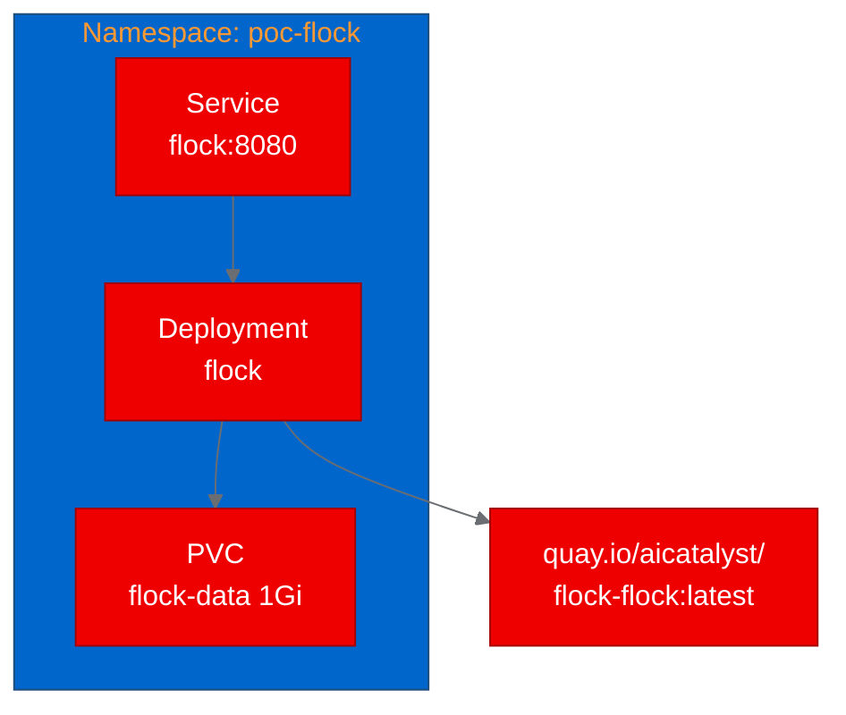

## Running a self-hosted large language model gateway on Red Hat OpenShift with Flock

Teams running large language model (LLM) inference on shared infrastructure quickly hit a wall: who is calling which model, how much are they using, and how do you enforce quotas without building a custom gateway from scratch? Flock is an open source Go project that solves this by turning any inference backend into a managed application programming interface (API) with built-in authentication, usage tracking, and an admin dashboard.

We deployed Flock on [Red Hat OpenShift AI](https://www.redhat.com/en/technologies/cloud-computing/openshift/openshift-ai) to validate whether it works as a containerized service alongside the platform's model serving infrastructure. All 4 test scenarios passed, and the entire pipeline from source code to running pod took under 10 minutes. Here is what we did and what we learned.

--------------------
**[Image Placeholder 1: Hero image showing Flock gateway concept]**

**Placement rationale**: Opening hero image to establish visual identity and communicate the gateway concept before readers dive into text.
**Image generation prompt**: Clean, modern technical illustration showing a central gateway node (in Red Hat red, #EE0000) routing traffic from multiple client icons on the left to multiple model server icons on the right. Use #151515 for background, #F0F0F0 for client nodes, #0066CC for model server nodes. Minimal, flat design, 16:9 aspect ratio.
**Alt text**: Diagram showing Flock as a central gateway routing requests from multiple API clients to multiple LLM inference backends.

--------------------

## What is Flock?

Flock is a single Go binary that acts as an LLM control plane. It sits between your users and your inference engines (Ollama, vLLM, llama.cpp, or cloud APIs like Anthropic and OpenAI) and provides:

- OpenAI and Anthropic API compatibility so existing tools work without changes
- Per-user API keys with daily token quotas
- Full audit logging of every request
- An embedded admin dashboard for monitoring usage and managing keys
- Prometheus metrics for integration with your cluster's monitoring stack
- Multi-machine routing to distribute load across inference backends

The entire project compiles to a single static binary with an embedded web user interface (UI). There is no database server to run: Flock uses pure-Go SQLite for state, which means no C library bindings and no native dependencies.

## Why a self-hosted LLM gateway matters

If you are running vLLM or Ollama on [Red Hat OpenShift AI](https://www.redhat.com/en/technologies/cloud-computing/openshift/openshift-ai), you have inference endpoints. What you do not have out of the box is a way to manage who can access them, track usage per team, and enforce spending limits.

Consider a platform team running 3 inference servers for 8 development teams. Without a gateway, every team hits the inference endpoints directly, there is no way to attribute costs, and one runaway script can starve everyone else. Flock gives you the API key layer, the quota enforcement, and the audit trail to manage shared inference infrastructure responsibly.


*Flock sits between client teams and inference backends, providing authentication, quota enforcement, and audit logging.*

## Containerizing Flock for Red Hat OpenShift

Flock requires Go 1.25, which is new enough that it is not available in standard Red Hat Universal Base Image (UBI) toolset images yet. We solved this with a multi-stage Dockerfile: the first stage uses the official Go 1.25 image to compile the binary, and the second stage copies it into UBI 9 Minimal for the runtime.


*Multi-stage build: Go 1.25 compiles a static binary, which is then copied into a minimal UBI 9 runtime image.*

Here is the key section of the Dockerfile:

```dockerfile
FROM docker.io/library/golang:1.25 AS builder
WORKDIR /opt/app-root/src
COPY go.mod go.sum ./
RUN go mod download
COPY . .
RUN CGO_ENABLED=0 GOOS=linux GOARCH=amd64 go build -trimpath -o /opt/app-root/flock ./cmd/flock

FROM registry.access.redhat.com/ubi9/ubi-minimal
COPY --from=builder /opt/app-root/flock /usr/local/bin/flock
COPY catalog/ /opt/app-root/catalog/
RUN chgrp -R 0 /opt/app-root && chmod -R g=u /opt/app-root
EXPOSE 8080
USER 1001
ENTRYPOINT ["flock"]
CMD ["up"]
```

The CGO_ENABLED=0 flag produces a fully static binary because Flock uses modernc.org/sqlite, a pure-Go SQLite implementation. No C libraries are needed at runtime.

The build ran on-cluster using an OpenShift binary build, which uploaded the source, compiled the Go binary, and pushed the resulting image to Quay.io in about 3 minutes.

## Deploying and testing on the cluster

The deployment needs one Deployment, one Service, and one PersistentVolumeClaim (PVC) for the SQLite database:

```yaml
apiVersion: apps/v1
kind: Deployment
metadata:
  name: flock
  namespace: poc-flock
spec:
  replicas: 1
  selector:
    matchLabels:
      app: flock
  template:
    spec:
      containers:
        - name: flock
          image: quay.io/aicatalyst/flock-flock:latest
          ports:
            - containerPort: 8080
          env:
            - name: FLOCK_LISTEN
              value: ":8080"
            - name: FLOCK_DATA_DIR
              value: "/opt/app-root/data"
          resources:
            requests:
              memory: "256Mi"
              cpu: "250m"
          readinessProbe:
            httpGet:
              path: /healthz
              port: 8080
```


*Deployment topology: one pod, one service, one persistent volume for SQLite state.*

Flock started up in seconds, auto-generated an admin API key, and began serving on port 8080. We ran 4 test scenarios:

| Test | Endpoint | Result | Details |
|---|---|---|---|
| Health check | /healthz | Pass | Returns "ok" in 30ms |
| Admin dashboard | / | Pass | Full HTML dashboard served |
| Models API | /v1/models | Pass | 401 without key, 200 with key |
| Prometheus metrics | /metrics | Pass | Exposes flock_router_* metrics |

The Models API test confirmed that Flock correctly enforces API key authentication on all /v1/* endpoints. This is the behavior you want from a gateway protecting your inference stack.

## What we learned

Flock is exceptionally container-friendly. The single-binary, pure-Go architecture with embedded assets means there is almost nothing to configure. No frontend build step, no database server, no C library binding complications. The container image is under 100MB.

The Go 1.25 requirement is the biggest friction point for containerization. Since UBI go-toolset images may not ship Go 1.25 yet, the multi-stage build with the upstream Go image is the practical path. This is a temporary issue that resolves as UBI images catch up.

API key management works out of the box. Flock generates an admin key on first startup and supports creating additional keys with per-user quotas through its admin API. You get basic multi-tenant access control without any additional infrastructure.

No inference engine is required to validate the gateway itself. Flock starts and serves its API and dashboard independently. For production use, you would point it at your vLLM or Ollama instances on Red Hat OpenShift AI using environment variables.

## Try it yourself

The complete deployment is available in the [aicatalyst-team/flock](https://github.com/aicatalyst-team/flock) repository on the autopoc-artifacts branch. You will find the UBI Dockerfile, Kubernetes manifests, validation test script, and full PoC report.

To deploy on your own [Red Hat OpenShift](https://www.redhat.com/en/technologies/cloud-computing/openshift) cluster:

```bash
git clone https://github.com/aicatalyst-team/flock
kubectl apply -f kubernetes/
```

Then configure FLOCK_OLLAMA_ENDPOINT to point at your inference backend and start routing LLM traffic through a proper gateway. For more on deploying inference servers, see the [Red Hat OpenShift AI documentation](https://docs.redhat.com/en/documentation/red_hat_openshift_ai/).
