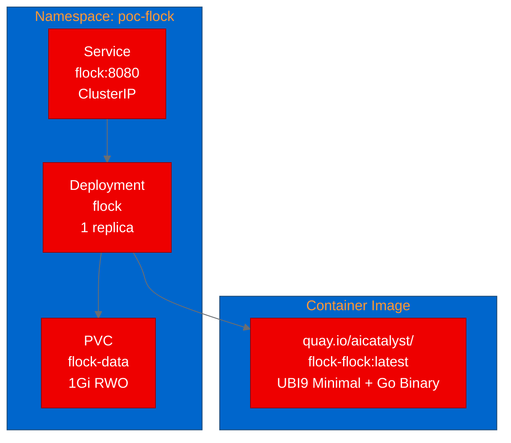

# PoC Report: Flock — Self-Hosted LLM Gateway on OpenShift

## Executive Summary

Flock is a self-hosted LLM gateway/control plane written in Go that provides a unified endpoint speaking both OpenAI and Anthropic APIs. This PoC successfully deployed Flock on OpenShift, validating its ability to run as a containerized service with health checks, an embedded admin dashboard, Prometheus metrics, and API key-protected endpoints.

**Result: SUCCESS** — All 4 test scenarios passed. Flock is a strong candidate for platform teams managing LLM inference infrastructure on OpenShift.

## Project Analysis

| Attribute | Value |
|---|---|
| **Repository** | [hadihonarvar/flock](https://github.com/hadihonarvar/flock) |
| **Language** | Go 1.25 |
| **License** | Apache 2.0 |
| **Stars** | 44 |
| **Category** | Model Inference / LLM Gateway |
| **GPU Required** | No |

### Components

| Component | Language | Build System | Port | ML Workload |
|---|---|---|---|---|
| flock | Go | go build | 8080 | No |

### Key Features
- OpenAI and Anthropic API compatibility
- Multi-machine inference routing (Ollama, vLLM, llama.cpp, MLX-LM)
- Per-user API keys with daily quotas
- Full audit logging
- Embedded admin dashboard (go:embed, Tailwind CSS)
- Prometheus metrics endpoint
- OpenTelemetry tracing support
- Pure-Go SQLite for state (no CGO)

## PoC Objectives

1. ✅ Verify Flock containerizes as a UBI-based multi-stage Go build
2. ✅ Demonstrate admin dashboard and API endpoints accessible via OpenShift Service
3. ✅ Validate health check, Prometheus metrics, and API key management
4. ✅ Confirm Flock operates independently without a local inference engine

## Pipeline Execution Summary

| Phase | Status | Duration | Notes |
|---|---|---|---|
| 1. Intake | ✅ Completed | ~1m | Single Go component identified |
| 2. Evaluate | ✅ Completed | ~1m | Score: 80/100 |
| 3. Fork | ✅ Completed | ~1m | Forked to aicatalyst-team/flock |
| 4. PoC Plan | ✅ Completed | ~1m | 4 test scenarios defined |
| 5. Containerize | ✅ Completed | ~1m | Multi-stage: golang:1.25 → ubi9-minimal |
| 6. Build | ✅ Completed | ~3m | OpenShift binary build, pushed to Quay |
| 7. Deploy | ✅ Completed | ~1m | Deployment + Service + PVC manifests |
| 8. Apply | ✅ Completed | ~3m | Pod running, health checks passing |
| 9. Test | ✅ Completed | ~1m | 4/4 scenarios passed |
| 10. Report | ✅ Completed | — | This document |

## Test Results

| Scenario | Status | Duration | Details |
|---|---|---|---|
| health-check | ✅ Pass | 0.03s | `/healthz` returns 200 "ok" |
| admin-dashboard | ✅ Pass | 0.02s | `/` serves full HTML dashboard with Tailwind CSS |
| models-api | ✅ Pass | 0.01s | `/v1/models` returns 401 without key (correct auth enforcement), 200 with key |
| prometheus-metrics | ✅ Pass | 0.01s | `/metrics` exposes `flock_router_*` and Go runtime metrics |

## Deployment Topology

## Infrastructure Deployed

| Resource | Name | Details |
|---|---|---|
| Namespace | poc-flock | Isolated PoC namespace |
| Deployment | flock | 1 replica, 256Mi-512Mi RAM, 250m-500m CPU |
| Service | flock (ClusterIP) | Port 8080 |
| PVC | flock-data | 1Gi ReadWriteOnce for SQLite state |
| Image | quay.io/aicatalyst/flock-flock:latest | Multi-stage: golang:1.25 builder + ubi9-minimal runtime |

## Containerization Approach

**Multi-stage Dockerfile:**
1. **Builder stage** (`golang:1.25`): Downloads dependencies, compiles single static binary with `CGO_ENABLED=0`
2. **Runtime stage** (`ubi9/ubi-minimal`): Copies binary + YAML catalog files, creates data directory, runs as UID 1001

**Key decisions:**
- Used official golang:1.25 image (not UBI go-toolset) because Go 1.25 is required and UBI may not have it yet
- `CGO_ENABLED=0` ensures pure static binary — the `modernc.org/sqlite` driver is pure Go
- Catalog YAML files are bundled into the image at `/opt/app-root/catalog/`
- Data directory at `/opt/app-root/data` is backed by a PVC for persistent SQLite state

## Recommendations

### Production Readiness
1. **Inference engine integration:** Deploy Ollama as a sidecar or separate pod and configure `FLOCK_OLLAMA_ENDPOINT` to enable actual model serving
2. **TLS termination:** Add an OpenShift Route with edge TLS for external access
3. **Resource scaling:** Current small profile (256Mi) is sufficient for the gateway alone; increase for production traffic
4. **API key management:** The admin key is generated at first startup and shown in logs — configure secure key rotation for production

### ODH/OpenShift AI Considerations
- Flock complements RHOAI's model serving stack by adding a gateway layer with API key management, quotas, and audit logging
- Can front-end vLLM instances deployed as InferenceServices on OpenShift AI
- Prometheus metrics integrate with the platform monitoring stack
- The embedded dashboard provides a lightweight alternative to separate observability tools

## Appendix

### Artifact Links
- **Fork:** [aicatalyst-team/flock](https://github.com/aicatalyst-team/flock)
- **Artifacts Branch:** [autopoc-artifacts](https://github.com/aicatalyst-team/flock/tree/autopoc-artifacts)
- **Container Image:** `quay.io/aicatalyst/flock-flock:latest`
- **PoC Plan:** [poc-plan.md](https://github.com/aicatalyst-team/flock/blob/autopoc-artifacts/poc-plan.md)
- **Test Script:** [poc_test.py](https://github.com/aicatalyst-team/flock/blob/autopoc-artifacts/poc_test.py)
